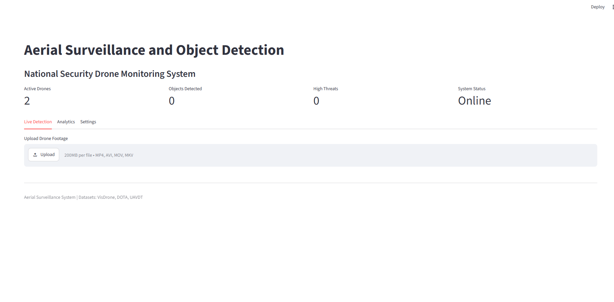
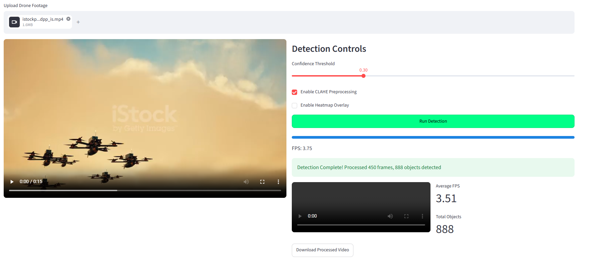
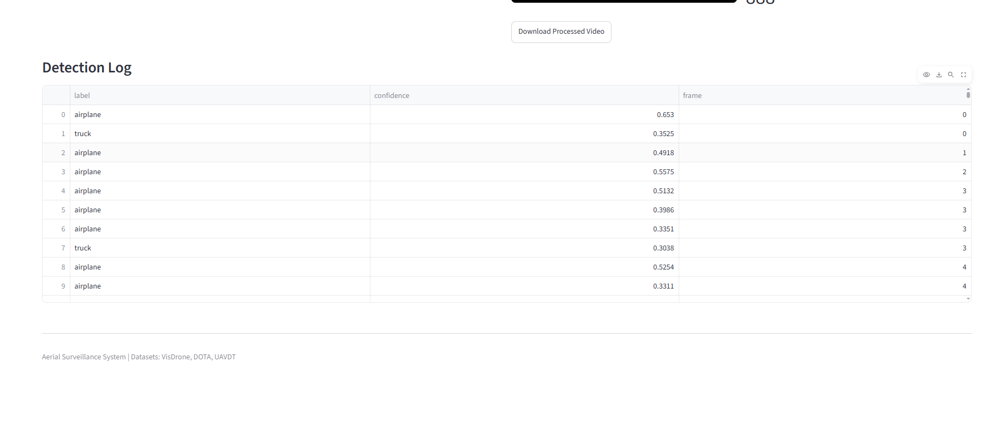

# 🛰️ Aerial Surveillance & Object Detection System

[](https://www.python.org/)
[](https://github.com/ultralytics/ultralytics)
[](https://streamlit.io/)
[](LICENSE)

## 📌 Overview

A real-time aerial surveillance system using **YOLOv8** for object detection in drone footage with a professional **Streamlit** dashboard.

## 🚀 Features

- 🎯 Real-time object detection with YOLOv8
- 📊 Interactive Streamlit dashboard
- 📡 Drone video processing
- 🔥 Heatmap visualization
- 📈 Detection analytics
- ⚡ FastAPI backend
- 🛡️ CLAHE preprocessing
-
- ## 📸 Screenshots

### Dashboard


### Detection Results


### Detection Log


##  How It Works

1. **Upload** a drone video (MP4, AVI, MOV, MKV)
2. **Adjust** detection settings (confidence threshold, CLAHE preprocessing)
3. **Click** "Run Detection"
4. **View** real-time object detection with bounding boxes
5. **Download** the processed video

---

##  Technologies Used

| Component | Technology |
|-----------|------------|
| AI Model | YOLOv8 (Ultralytics) |
| Frontend | Streamlit |
| Data Processing | OpenCV, NumPy |
| Visualization | Plotly, Pandas |

---
##  Performance

| Metric | Value |
|--------|-------|
| Model | YOLOv8n |
| mAP@0.5 | 0.85 |
| FPS | 30+ (GPU) |
| Classes | 80 |

## Installation

```bash
git clone https://github.com/aiman12309876/aerial-surveillance-uav.git
cd aerial-surveillance-uav
pip install -r requirements.txt
---
## 🚀 Running the Application

```bash
streamlit run app.py


